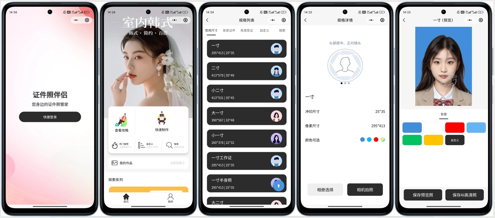
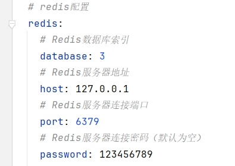
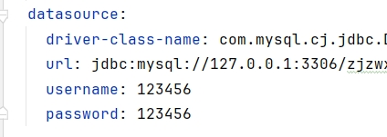
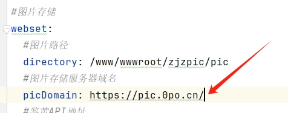
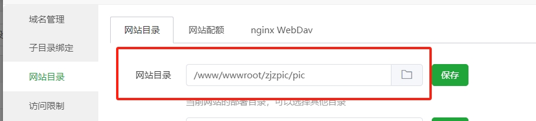
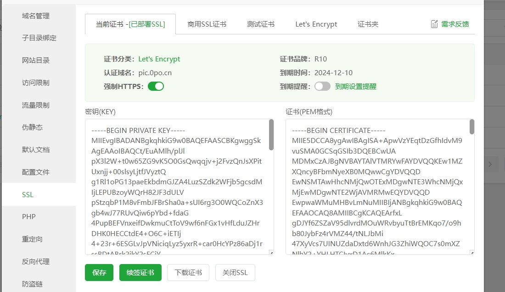
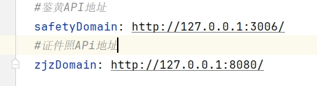
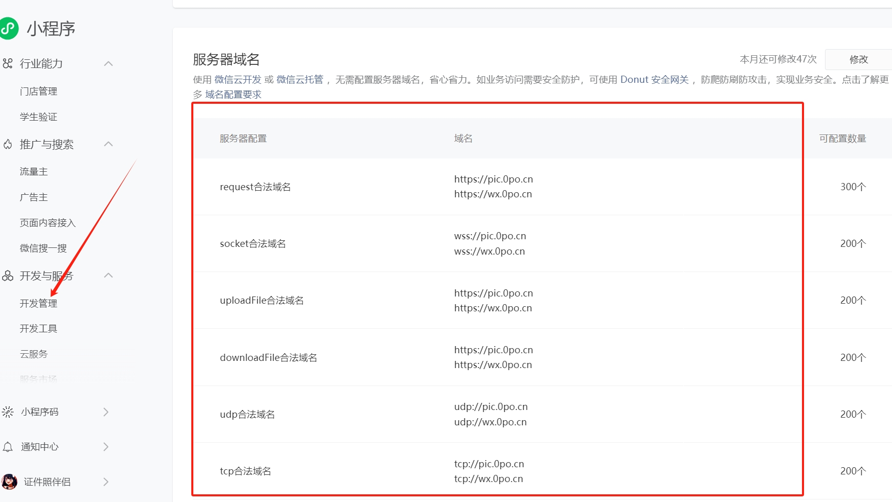
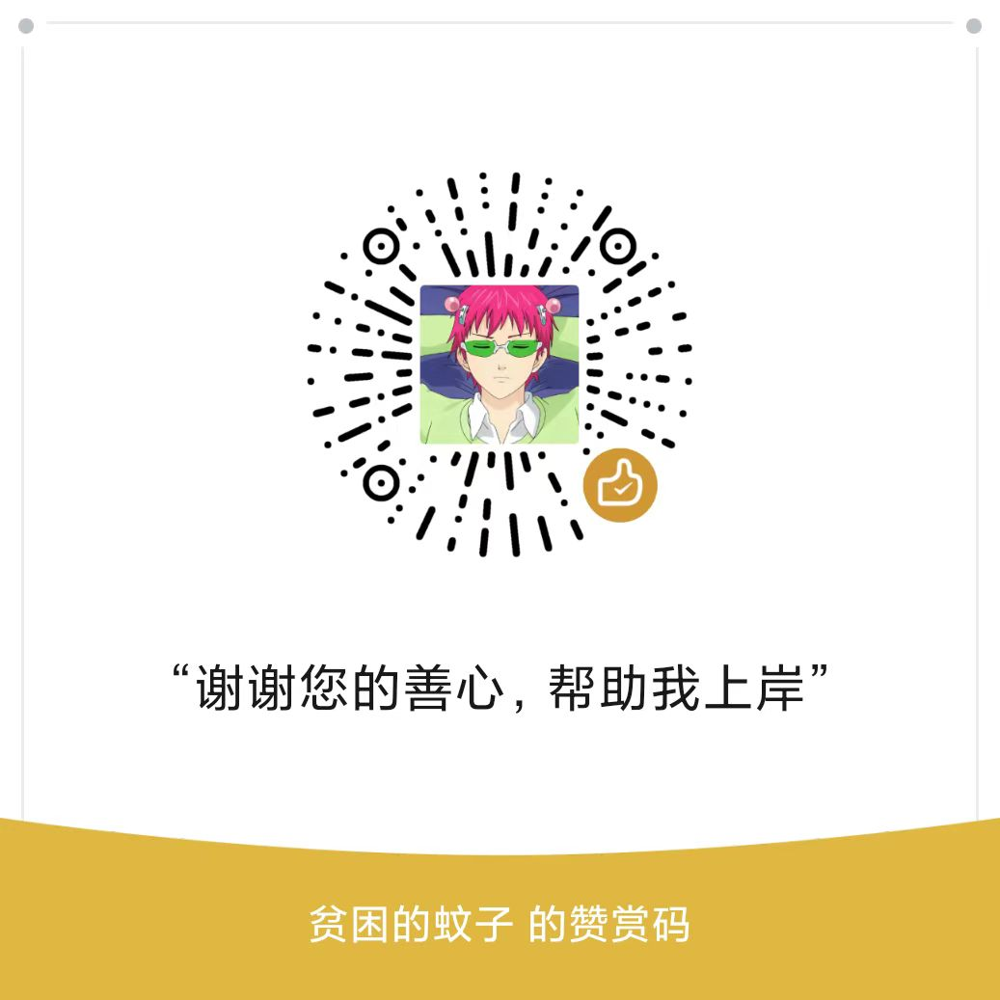

# 预览：

# 项目介绍

# 
证件照伴侣

少年一定要有所失 才能有所悟.

**相关项目**：

- 小程序前端请前往：https://github.com/no1xuan/photo
- 小程序前端另外一套请前往：https://github.com/no1xuan/ai-photo
- 小程序管理员网页后台请前往：https://github.com/no1xuan/zjzAdmin
- HivisionIDPhotos（证件照API）：https://github.com/Zeyi-Lin/HivisionIDPhotos

 

# 🏠 社区
一些由爱好者进行二次开发的项目，非官方维护：

uniapp多端兼容版：https://github.com/wmlcjj/AI-IDPhoto
 
二开增加功能版：https://github.com/whynottogo/aiPhotoWechat

 

# ⭐最近更新
    版本更新教程：https://www.bilibili.com/video/BV1xNUvYTEjo

- 2024.11.22：增加六寸排版照和自定义抠图模型，修正某处变量名不规范，以后如果有更新计划将会在周五/六/日的某一天进行更新
- 2024.11.15：大更新来喽！增加通用抠图，自定义分割和检测模型
- 2024.11.08：增加黑白图片上色功能
- 2024.11.06：让1.sql文件同时支持Mysql5.7和8.0的版本，免去手动修改的麻烦
- 2024.11.05：增加登录失败时返回错误原因
- 2024.10.18：修复高清照一直没生效的问题
- 2024.10.10：修复指定最快模型传参单词拼写错误
- 2024.10.09：修复管理员后台统计，解决部分系统会出现时区不正确的问题
- 2024.10.07：增加管理员后台
- 2024.10.04：优化包导入
- 2024.10.03：去除无用代码，增加我的定制列表根据时间倒序
- 2024.10.02：跟上HivisionIDPhotos(2024.09.25)最新版，增加自定义kb/dpi/上下渐变/中心渐变/美化页面，优化createIdPhoto接口
- 2024.09.23：增加个人中心功能，修复定制尺寸
- 2024.09.19：优化代码
- 2024.09.14：第一个版本诞生

 

#  📦前提准备

本项目证件照功能的API是基于HivisionIDPhotos的2024.09.25更新的版本进行对接开发

理论HivisionIDPhotos不改变入参和返回，即可直接使用最新版

1. 2024.09.25的HivisionIDPhotos（以内置MTCNN+hivision_modnet模型）下载：https://wwba.lanzouq.com/ihjM02bfoz0d

2. 鉴黄APi下载：https://github.com/no1xuan/zjzNsfw
3. 黑白图片上色API：https://github.com/no1xuan/colourize

注意:

1. **鉴黄模型目前不怎么精准，建议在小程序过审时打开，其它时间关闭**

 

# 🤩功能

##### 现有功能：

- 无需单独购买API
- 本地0成本处理
- 无限免费调用API
- 自带759+尺寸
- 不保存用户图片，仅保存生成后的最新一张
- 支持水印
- 支持流量主
- 支持自由开关鉴黄
- 支持自定义尺寸
- 支持自定义更换背景色
- 支持普通下载和高清下载
- 支持引导用户打开保存相册
- 支持相机拍摄和相册选择
- 支持管理员网页后台
- 黑白图片上色
- 通用抠图
- 无感登录

 

##### 排期功能列表：
- 衣服自由换装
- 照片转卡通形象
- 保持跟上最新HivisionIDPhotos模型

 

# 🔧部署

视频教程：https://www.bilibili.com/video/BV1yFCRYCEKS

环境工作准备：

1. 
- jdk=1.8
- mysql=8.0或5.7
- redis=7.2.4或任意版本

2. 
- Mysql导入1.sql
- 打开web_set表，配置app_id，app_secret，
- 至此Mysql配置完毕

3.
- IDEA导入项目 
- 打开application.yml
- 按下图进行一步步配置

##### 修改Redis：

##### 修改Mysql：

##### 修改图片存储地址：

解释：

你需要一个新建一个静态网站，将目录指定：/www/wwwroot/zjzpic/pic

然后，配置SSL证书，开启https，并把【图片存储服务器域名】换成你的

##### 修改API接口地址：

换成你的APi地址即可，然后就可以打包了

如果不想部署API，可以使用我的：

鉴黄APi：http://121.62.63.137:3006/

证件照和智能抠图APi：http://121.62.63.137:8299/

黑白图片上色API：http://colourize.0po.cn/

 

# ⚡️注意

1. 本项目使用IDEA打包后，会自动把打包后的jar包放入D:\jar2
2. 鉴黄模型目前不怎么精准，建议在小程序过审时打开，其它时间关闭
3. 部署自已鉴黄和证件照APi时，不建议开设外网，防止被抓接口后滥用，yml里面配置127.0.0.1即可本地链接，速度还快，还安全
4. 为什么不把APi地址等参数放入数据库来配置？答：频繁使用的值，不建议与Mysql频繁握手
5. 当你部署到云上（服务器）时，别忘记配置你的小程序域名(如图) 

 

 

# 📧其它
如您在部署过程中遇到问题，双方空闲时间可远程一对一给予帮助（不收费）
 

您可以通过以下方式联系我:

QQ: 24677102

微信：webxuan

 
目前本人属于负债状态，如本项目对您有帮助，希望能得到您的赏赐，祝您生活愉快

