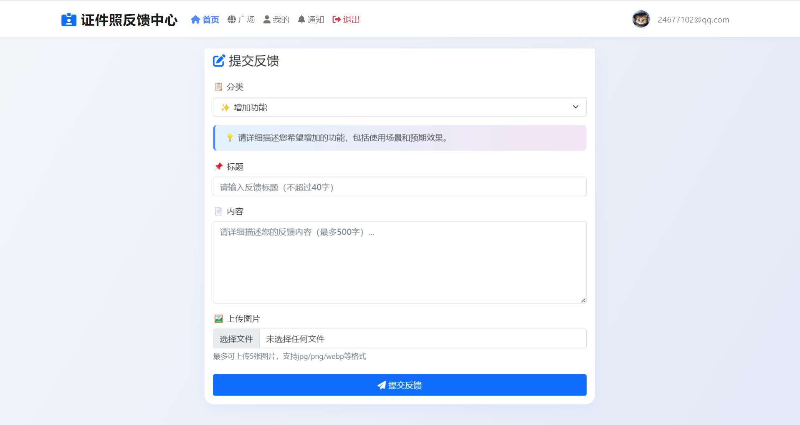

# 📝反馈

目前我正在进行程序大更新，新版本**不支持平滑升级**！

---

##### 对于二开者

新版本决定牺牲一些性能和速度以提高便利性，但仍然**不提供接口文档**。  
如果你希望保留性能和速度，请保留 **2025.05.03** 版本的前后端代码，包括管理员端。

---

##### 提交您的想法

- 目前 HivisionIDPhotos 的功能、性能和 bug 已经无法满足需求，如果你懂 Python，希望你能利用业余时间参与 HivisionIDPhotos 魔改计划
- 如果你有更好的想法、发现 bug、喜欢别的小程序页面、觉得别的小程序某个功能或逻辑很好等等……
- 欢迎提交反馈，因为一个人的想法是有限的，但我希望产品能让大家都满意

<h3 align="center">
  反馈提交地址: <a href="https://fk.0po.cn">https://fk.0po.cn</a>
</h3>

# 🔍预览：

# 📝项目介绍

# 
证件照伴侣

2025我们一起加油，心如所愿，梦想成真.

**相关项目**：

- 小程序前端第一套：https://github.com/no1xuan/photo
- 小程序前端第二套：https://github.com/no1xuan/ai-photo
- 小程序前端第三套：https://github.com/no1xuan/id-photo-wechat
- 小程序管理员网页后台：https://github.com/no1xuan/zjzAdmin
- HivisionIDPhotos（证件照API）：https://github.com/Zeyi-Lin/HivisionIDPhotos

 

# 🏠 社区
一些由爱好者进行二次开发的项目，非官方维护：

uniapp多端兼容版：https://github.com/wmlcjj/AI-IDPhoto
 
二开增加功能版：https://github.com/whynottogo/aiPhotoWechat

 

# ⭐最近更新
    版本更新教程：https://www.bilibili.com/video/BV1xNUvYTEjo

- 2025.07.16：目前我正在大更新这个程序，预计要很久，新版本决定损失一些性能和速度从而提高方便性，但仍然不推出接口文档，如果你不希望丢失性能和速度请保留2025.05.03版本的前后端代码
- 2025.05.03：修正变量名使用错误
- 2024.END：  2024年最后一个版本，感谢有你🙏，2025年我们一起加油💪！ 修复所有的历史遗留包裹，增加图片编辑，增加物理删除图片，增强管理员后台
- 2024.12.17：跟上HivisionIDPhotos(2024.11.20)，增加美颜，探索功能增加每日免费次数，功能可以管理员后台自由开关控制，修复90%的历史遗留包裹，升级到此版本的sql更新教程：https://www.0po.cn/archives/50
- 2024.12.11：紧急修复图片动漫风功能图片太大导致无法生成的问题
- 2024.12.06：增加图片动漫风功能
- 2024.11.29：优化加快itemList和photoList接口，修正六寸排版照存储库名不规范
- 2024.11.22：增加六寸排版照和自定义抠图模型，修正某处变量名不规范
- 2024.11.15：增加通用抠图，自定义分割和检测模型
- 2024.11.08：增加黑白图片上色功能
- 2024.11.06：让1.sql文件同时支持Mysql5.7和8.0的版本，免去手动修改的麻烦
- 2024.11.05：增加登录失败时返回错误原因
- 2024.10.18：修复高清照一直没生效的问题
- 2024.10.10：修复指定最快模型传参单词拼写错误
- 2024.10.09：修复管理员后台统计，解决部分系统会出现时区不正确的问题
- 2024.10.07：增加管理员后台
- 2024.10.04：优化包导入
- 2024.10.03：去除无用代码，增加我的定制列表根据时间倒序
- 2024.10.02：跟上HivisionIDPhotos(2024.09.25)最新版，增加自定义kb/dpi/上下渐变/中心渐变/美化页面，优化createIdPhoto接口
- 2024.09.23：增加个人中心功能，修复定制尺寸
- 2024.09.19：优化代码
- 2024.09.14：第一个版本诞生

 

#  📦私有化部署API接口说明

本项目证件照功能的API是基于HivisionIDPhotos的2024.11.20的版本进行对接开发

理论HivisionIDPhotos不改变入参和返回，即可直接使用最新版

1. 2024.11.20的HivisionIDPhotos（以内置MTCNN+hivision_modnet模型）下载：https://wwba.lanzouq.com/ipyhs2hzujgf
    
   （注：智能抠图功能需要单独前往HivisionIDPhotos下载birefnet-v1-lite模型）

3. 鉴黄API下载：https://github.com/no1xuan/zjzNsfw
4. 黑白图片上色API：https://github.com/no1xuan/colourize
5. 动漫风图片API：https://github.com/no1xuan/cartoon

注意:

1. **鉴黄模型目前不怎么精准，建议在小程序过审时打开，其它时间关闭**
2. 证件照API部署教程：https://www.bilibili.com/video/BV1urbYzvEzo
3. 鉴黄API部署教程：https://www.bilibili.com/video/BV1FqbnzSEM7
4. 黑白图片上色API部署教程：https://www.bilibili.com/video/BV13FbWzkEJj
5. 动漫风图片API部署教程：https://www.bilibili.com/video/BV1y5bWzwEAq

 

# 🤩功能

##### 现有功能：

- 无需单独购买API
- 本地0成本处理
- 无限免费调用API
- 自带700+尺寸
- 不保存用户图片，仅保存生成后的最新一张
- 支持水印
- 支持流量主
- 支持自由开关鉴黄
- 支持自定义尺寸
- 支持自定义更换背景色
- 支持普通下载和高清下载
- 支持引导用户打开保存相册
- 支持相机拍摄和相册选择
- 支持管理员网页后台
- 黑白图片上色
- 智能抠图
- 动漫图片
- 图片编辑
- 六寸排版
- 无感登录

 

##### 排期功能列表：
- 微信支付
- 衣服自由换装
- 保持跟上最新HivisionIDPhotos模型

 

# 🔧部署

视频教程：https://www.bilibili.com/video/BV1yFCRYCEKS

环境工作准备：

1. 
- jdk=1.8
- mysql=8.0或5.7
- redis=7.2.4或任意版本

2. 
- Mysql导入1.sql
- 打开web_set表，配置app_id，app_secret，
- 至此Mysql配置完毕

3.
- IDEA导入项目 
- 打开application.yml
- 按下图进行一步步配置

##### 修改Redis：

##### 修改Mysql：

##### 修改图片存储地址：

解释：

你需要一个新建一个静态网站，将目录指定：/www/wwwroot/zjzpic/pic

然后，配置SSL证书，开启https，并把【图片存储服务器域名】换成你的

##### 修改API接口地址：

换成你的API地址即可，然后就可以打包了

如果不想部署API，可以使用我的：

证件照和智能抠图API：http://zjz.0po.cn/

鉴黄API：暂不提供

黑白图片上色API：http://colourize.0po.cn/

动漫风图片API：http://cartoon.0po.cn/

 

# ⚡️注意
1. 如果因为动漫风图片导致小程序不过审核，解决办法：管理员后台关闭这个功能，然后去提交审核，等审核通过后再开启
2. 本项目使用IDEA打包后，会自动把打包后的jar包放入D:\jar2
3. 鉴黄模型目前不怎么精准，建议在小程序过审时打开，其它时间关闭
4. 部署自已鉴黄和证件照APi时，不建议开设外网，防止被抓接口后滥用，yml里面配置127.0.0.1即可本地链接，速度还快，还安全
5. 为什么不把API地址等参数放入数据库来配置？答：频繁使用的值，不建议与Mysql频繁握手
6. 当你部署到云上（服务器）时，别忘记配置你的小程序域名(如图，JAVA后端域名+图片存储服务器域名) 

 

 

# 🌟🤝🌟给二开作者的一些话
目前整个项目已完结，除了发生漏洞基本不会再去更新，后端和前端注释都有写，代码没有使用很复杂的拆分，很适合编程初学者，所以你可以放心大胆的去二开创作
 
在这个项目里，完全由本人一人完工，产品，UI，前端，后端，测试，运维很费心，一些地方做的不够好，十分抱歉
 
我是初中开始接触编程，本人02年，见过互联网全民站长的时代，也见过当时互联网猪都能起飞的时代，本次也特别感谢HivisionIDPhotos让我找回当年的热爱，目前我已辞去程序员工作，已经彻底转行

 

# 📧其它
您可以通过以下方式联系我:
 

QQ: 24677102

微信：webxuan

 
目前本人属于负债状态，如本项目对您有帮助，希望能得到您的赞赏。祝您2025年财源滚滚，运气爆棚！

